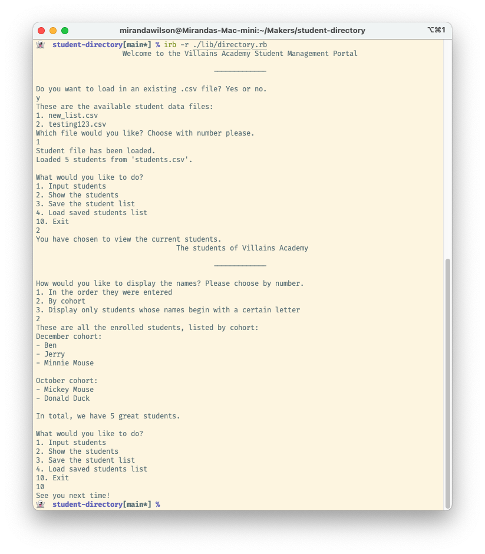

## Student Directory
The student directory script enables management of the students enrolled at Villains Academy.

This exercise formed part of the pre-course work for the [Makers Academy](https://makers.tech) coding bootcamp. The goal was to practise basic Ruby, including reading and writing CSV files. There are no tests. During the course, I returned to this repo and cleaned up the code somewhat, to practise class extraction.

### Installation and Usage
Requires Ruby 2.6+ (3.0.0 works fine).
* Clone this repo
* Navigate into the cloned folder
* Run `irb -r ./lib/student-directory`
* Play with the code in the IRB REPL

This screenshot gives an example of how it looks in IRB:

### Known Issues
The capitalisation of the student names is lost as they are entered.
Currently, specifying a cohort doesn't work - all students are entered with the current month.
